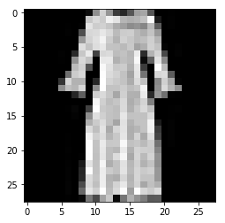
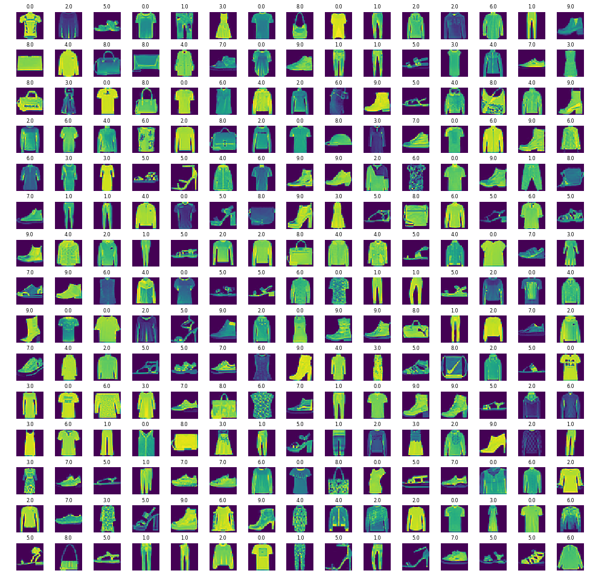
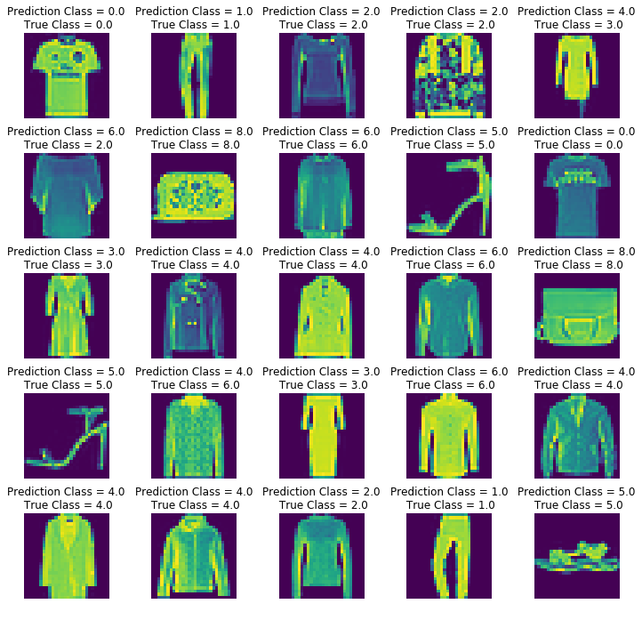
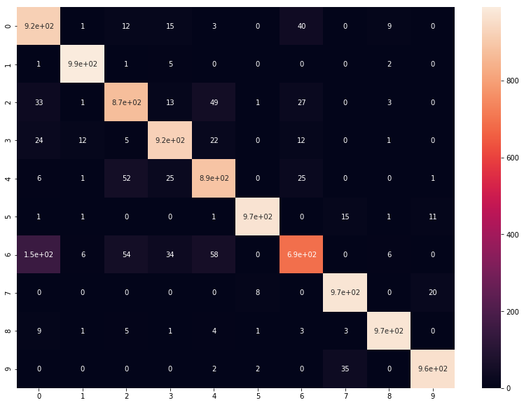

# FASHION CLASS CLASSIFICATION 

# STEP #1: PROBLEM STATEMENT AND BUSINESS CASE

Fashion training set consists of 70,000 images divided into 60,000 training and 10,000 testing samples. Dataset sample consists of 28x28 grayscale image, associated with a label from 10 classes. 

The 10 classes are as follows:  
0 => T-shirt/top
1 => Trouser
2 => Pullover
3 => Dress
4 => Coat
5 => Sandal
6 => Shirt
7 => Sneaker
8 => Bag
9 => Ankle boot

Each image is 28 pixels in height and 28 pixels in width, for a total of 784 pixels in total. Each pixel has a single pixel-value associated with it, indicating the lightness or darkness of that pixel, with higher numbers meaning darker. This pixel-value is an integer between 0 and 255. 


# STEP #2: IMPORTING DATA


```python
# import libraries 
import pandas as pd # Import Pandas for data manipulation using dataframes
import numpy as np # Import Numpy for data statistical analysis 
import matplotlib.pyplot as plt # Import matplotlib for data visualisation
import seaborn as sns
import random

```


```python
# dataframes creation for both training and testing datasets 
fashion_train_df = pd.read_csv('/Users/monipeni/Documents/Machine Learning Practical/Module 2/fashion-mnist_train.csv',sep=',')
fashion_test_df = pd.read_csv('/Users/monipeni/Documents/Machine Learning Practical/Module 2/fashion-mnist_test.csv', sep = ',')
```

# STEP #3: VISUALIZATION OF THE DATASET  


```python
# Let's view the head of the training dataset
# 784 indicates 28x28 pixels and 1 coloumn for the label
# After you check the tail, 60,000 training dataset are present
fashion_train_df.head()
```


<div>
<style scoped>
    .dataframe tbody tr th:only-of-type {
        vertical-align: middle;
    }

    .dataframe tbody tr th {
        vertical-align: top;
    }

    .dataframe thead th {
        text-align: right;
    }
</style>
<table border="1" class="dataframe">
  <thead>
    <tr style="text-align: right;">
      <th></th>
      <th>label</th>
      <th>pixel1</th>
      <th>pixel2</th>
      <th>pixel3</th>
      <th>pixel4</th>
      <th>pixel5</th>
      <th>pixel6</th>
      <th>pixel7</th>
      <th>pixel8</th>
      <th>pixel9</th>
      <th>...</th>
      <th>pixel775</th>
      <th>pixel776</th>
      <th>pixel777</th>
      <th>pixel778</th>
      <th>pixel779</th>
      <th>pixel780</th>
      <th>pixel781</th>
      <th>pixel782</th>
      <th>pixel783</th>
      <th>pixel784</th>
    </tr>
  </thead>
  <tbody>
    <tr>
      <th>0</th>
      <td>2</td>
      <td>0</td>
      <td>0</td>
      <td>0</td>
      <td>0</td>
      <td>0</td>
      <td>0</td>
      <td>0</td>
      <td>0</td>
      <td>0</td>
      <td>...</td>
      <td>0</td>
      <td>0</td>
      <td>0</td>
      <td>0</td>
      <td>0</td>
      <td>0</td>
      <td>0</td>
      <td>0</td>
      <td>0</td>
      <td>0</td>
    </tr>
    <tr>
      <th>1</th>
      <td>9</td>
      <td>0</td>
      <td>0</td>
      <td>0</td>
      <td>0</td>
      <td>0</td>
      <td>0</td>
      <td>0</td>
      <td>0</td>
      <td>0</td>
      <td>...</td>
      <td>0</td>
      <td>0</td>
      <td>0</td>
      <td>0</td>
      <td>0</td>
      <td>0</td>
      <td>0</td>
      <td>0</td>
      <td>0</td>
      <td>0</td>
    </tr>
    <tr>
      <th>2</th>
      <td>6</td>
      <td>0</td>
      <td>0</td>
      <td>0</td>
      <td>0</td>
      <td>0</td>
      <td>0</td>
      <td>0</td>
      <td>5</td>
      <td>0</td>
      <td>...</td>
      <td>0</td>
      <td>0</td>
      <td>0</td>
      <td>30</td>
      <td>43</td>
      <td>0</td>
      <td>0</td>
      <td>0</td>
      <td>0</td>
      <td>0</td>
    </tr>
    <tr>
      <th>3</th>
      <td>0</td>
      <td>0</td>
      <td>0</td>
      <td>0</td>
      <td>1</td>
      <td>2</td>
      <td>0</td>
      <td>0</td>
      <td>0</td>
      <td>0</td>
      <td>...</td>
      <td>3</td>
      <td>0</td>
      <td>0</td>
      <td>0</td>
      <td>0</td>
      <td>1</td>
      <td>0</td>
      <td>0</td>
      <td>0</td>
      <td>0</td>
    </tr>
    <tr>
      <th>4</th>
      <td>3</td>
      <td>0</td>
      <td>0</td>
      <td>0</td>
      <td>0</td>
      <td>0</td>
      <td>0</td>
      <td>0</td>
      <td>0</td>
      <td>0</td>
      <td>...</td>
      <td>0</td>
      <td>0</td>
      <td>0</td>
      <td>0</td>
      <td>0</td>
      <td>0</td>
      <td>0</td>
      <td>0</td>
      <td>0</td>
      <td>0</td>
    </tr>
  </tbody>
</table>
<p>5 rows × 785 columns</p>
</div>


```python
# Let's view the last elements in the training dataset
fashion_train_df.tail()
```


<div>
<style scoped>
    .dataframe tbody tr th:only-of-type {
        vertical-align: middle;
    }

    .dataframe tbody tr th {
        vertical-align: top;
    }

    .dataframe thead th {
        text-align: right;
    }
</style>
<table border="1" class="dataframe">
  <thead>
    <tr style="text-align: right;">
      <th></th>
      <th>label</th>
      <th>pixel1</th>
      <th>pixel2</th>
      <th>pixel3</th>
      <th>pixel4</th>
      <th>pixel5</th>
      <th>pixel6</th>
      <th>pixel7</th>
      <th>pixel8</th>
      <th>pixel9</th>
      <th>...</th>
      <th>pixel775</th>
      <th>pixel776</th>
      <th>pixel777</th>
      <th>pixel778</th>
      <th>pixel779</th>
      <th>pixel780</th>
      <th>pixel781</th>
      <th>pixel782</th>
      <th>pixel783</th>
      <th>pixel784</th>
    </tr>
  </thead>
  <tbody>
    <tr>
      <th>59995</th>
      <td>9</td>
      <td>0</td>
      <td>0</td>
      <td>0</td>
      <td>0</td>
      <td>0</td>
      <td>0</td>
      <td>0</td>
      <td>0</td>
      <td>0</td>
      <td>...</td>
      <td>0</td>
      <td>0</td>
      <td>0</td>
      <td>0</td>
      <td>0</td>
      <td>0</td>
      <td>0</td>
      <td>0</td>
      <td>0</td>
      <td>0</td>
    </tr>
    <tr>
      <th>59996</th>
      <td>1</td>
      <td>0</td>
      <td>0</td>
      <td>0</td>
      <td>0</td>
      <td>0</td>
      <td>0</td>
      <td>0</td>
      <td>0</td>
      <td>0</td>
      <td>...</td>
      <td>73</td>
      <td>0</td>
      <td>0</td>
      <td>0</td>
      <td>0</td>
      <td>0</td>
      <td>0</td>
      <td>0</td>
      <td>0</td>
      <td>0</td>
    </tr>
    <tr>
      <th>59997</th>
      <td>8</td>
      <td>0</td>
      <td>0</td>
      <td>0</td>
      <td>0</td>
      <td>0</td>
      <td>0</td>
      <td>0</td>
      <td>0</td>
      <td>0</td>
      <td>...</td>
      <td>160</td>
      <td>162</td>
      <td>163</td>
      <td>135</td>
      <td>94</td>
      <td>0</td>
      <td>0</td>
      <td>0</td>
      <td>0</td>
      <td>0</td>
    </tr>
    <tr>
      <th>59998</th>
      <td>8</td>
      <td>0</td>
      <td>0</td>
      <td>0</td>
      <td>0</td>
      <td>0</td>
      <td>0</td>
      <td>0</td>
      <td>0</td>
      <td>0</td>
      <td>...</td>
      <td>0</td>
      <td>0</td>
      <td>0</td>
      <td>0</td>
      <td>0</td>
      <td>0</td>
      <td>0</td>
      <td>0</td>
      <td>0</td>
      <td>0</td>
    </tr>
    <tr>
      <th>59999</th>
      <td>7</td>
      <td>0</td>
      <td>0</td>
      <td>0</td>
      <td>0</td>
      <td>0</td>
      <td>0</td>
      <td>0</td>
      <td>0</td>
      <td>0</td>
      <td>...</td>
      <td>0</td>
      <td>0</td>
      <td>0</td>
      <td>0</td>
      <td>0</td>
      <td>0</td>
      <td>0</td>
      <td>0</td>
      <td>0</td>
      <td>0</td>
    </tr>
  </tbody>
</table>
<p>5 rows × 785 columns</p>
</div>


```python
# Let's view the head of the testing dataset
fashion_test_df.head()
```


<div>
<style scoped>
    .dataframe tbody tr th:only-of-type {
        vertical-align: middle;
    }

    .dataframe tbody tr th {
        vertical-align: top;
    }

    .dataframe thead th {
        text-align: right;
    }
</style>
<table border="1" class="dataframe">
  <thead>
    <tr style="text-align: right;">
      <th></th>
      <th>label</th>
      <th>pixel1</th>
      <th>pixel2</th>
      <th>pixel3</th>
      <th>pixel4</th>
      <th>pixel5</th>
      <th>pixel6</th>
      <th>pixel7</th>
      <th>pixel8</th>
      <th>pixel9</th>
      <th>...</th>
      <th>pixel775</th>
      <th>pixel776</th>
      <th>pixel777</th>
      <th>pixel778</th>
      <th>pixel779</th>
      <th>pixel780</th>
      <th>pixel781</th>
      <th>pixel782</th>
      <th>pixel783</th>
      <th>pixel784</th>
    </tr>
  </thead>
  <tbody>
    <tr>
      <th>0</th>
      <td>0</td>
      <td>0</td>
      <td>0</td>
      <td>0</td>
      <td>0</td>
      <td>0</td>
      <td>0</td>
      <td>0</td>
      <td>9</td>
      <td>8</td>
      <td>...</td>
      <td>103</td>
      <td>87</td>
      <td>56</td>
      <td>0</td>
      <td>0</td>
      <td>0</td>
      <td>0</td>
      <td>0</td>
      <td>0</td>
      <td>0</td>
    </tr>
    <tr>
      <th>1</th>
      <td>1</td>
      <td>0</td>
      <td>0</td>
      <td>0</td>
      <td>0</td>
      <td>0</td>
      <td>0</td>
      <td>0</td>
      <td>0</td>
      <td>0</td>
      <td>...</td>
      <td>34</td>
      <td>0</td>
      <td>0</td>
      <td>0</td>
      <td>0</td>
      <td>0</td>
      <td>0</td>
      <td>0</td>
      <td>0</td>
      <td>0</td>
    </tr>
    <tr>
      <th>2</th>
      <td>2</td>
      <td>0</td>
      <td>0</td>
      <td>0</td>
      <td>0</td>
      <td>0</td>
      <td>0</td>
      <td>14</td>
      <td>53</td>
      <td>99</td>
      <td>...</td>
      <td>0</td>
      <td>0</td>
      <td>0</td>
      <td>0</td>
      <td>63</td>
      <td>53</td>
      <td>31</td>
      <td>0</td>
      <td>0</td>
      <td>0</td>
    </tr>
    <tr>
      <th>3</th>
      <td>2</td>
      <td>0</td>
      <td>0</td>
      <td>0</td>
      <td>0</td>
      <td>0</td>
      <td>0</td>
      <td>0</td>
      <td>0</td>
      <td>0</td>
      <td>...</td>
      <td>137</td>
      <td>126</td>
      <td>140</td>
      <td>0</td>
      <td>133</td>
      <td>224</td>
      <td>222</td>
      <td>56</td>
      <td>0</td>
      <td>0</td>
    </tr>
    <tr>
      <th>4</th>
      <td>3</td>
      <td>0</td>
      <td>0</td>
      <td>0</td>
      <td>0</td>
      <td>0</td>
      <td>0</td>
      <td>0</td>
      <td>0</td>
      <td>0</td>
      <td>...</td>
      <td>0</td>
      <td>0</td>
      <td>0</td>
      <td>0</td>
      <td>0</td>
      <td>0</td>
      <td>0</td>
      <td>0</td>
      <td>0</td>
      <td>0</td>
    </tr>
  </tbody>
</table>
<p>5 rows × 785 columns</p>
</div>


```python
# Let's view the last elements in the testing dataset
fashion_test_df.tail()
```


<div>
<style scoped>
    .dataframe tbody tr th:only-of-type {
        vertical-align: middle;
    }

    .dataframe tbody tr th {
        vertical-align: top;
    }

    .dataframe thead th {
        text-align: right;
    }
</style>
<table border="1" class="dataframe">
  <thead>
    <tr style="text-align: right;">
      <th></th>
      <th>label</th>
      <th>pixel1</th>
      <th>pixel2</th>
      <th>pixel3</th>
      <th>pixel4</th>
      <th>pixel5</th>
      <th>pixel6</th>
      <th>pixel7</th>
      <th>pixel8</th>
      <th>pixel9</th>
      <th>...</th>
      <th>pixel775</th>
      <th>pixel776</th>
      <th>pixel777</th>
      <th>pixel778</th>
      <th>pixel779</th>
      <th>pixel780</th>
      <th>pixel781</th>
      <th>pixel782</th>
      <th>pixel783</th>
      <th>pixel784</th>
    </tr>
  </thead>
  <tbody>
    <tr>
      <th>9995</th>
      <td>0</td>
      <td>0</td>
      <td>0</td>
      <td>0</td>
      <td>0</td>
      <td>0</td>
      <td>0</td>
      <td>0</td>
      <td>0</td>
      <td>0</td>
      <td>...</td>
      <td>32</td>
      <td>23</td>
      <td>14</td>
      <td>20</td>
      <td>0</td>
      <td>0</td>
      <td>1</td>
      <td>0</td>
      <td>0</td>
      <td>0</td>
    </tr>
    <tr>
      <th>9996</th>
      <td>6</td>
      <td>0</td>
      <td>0</td>
      <td>0</td>
      <td>0</td>
      <td>0</td>
      <td>0</td>
      <td>0</td>
      <td>0</td>
      <td>0</td>
      <td>...</td>
      <td>0</td>
      <td>0</td>
      <td>0</td>
      <td>2</td>
      <td>52</td>
      <td>23</td>
      <td>28</td>
      <td>0</td>
      <td>0</td>
      <td>0</td>
    </tr>
    <tr>
      <th>9997</th>
      <td>8</td>
      <td>0</td>
      <td>0</td>
      <td>0</td>
      <td>0</td>
      <td>0</td>
      <td>0</td>
      <td>0</td>
      <td>0</td>
      <td>0</td>
      <td>...</td>
      <td>175</td>
      <td>172</td>
      <td>172</td>
      <td>182</td>
      <td>199</td>
      <td>222</td>
      <td>42</td>
      <td>0</td>
      <td>1</td>
      <td>0</td>
    </tr>
    <tr>
      <th>9998</th>
      <td>8</td>
      <td>0</td>
      <td>1</td>
      <td>3</td>
      <td>0</td>
      <td>0</td>
      <td>0</td>
      <td>0</td>
      <td>0</td>
      <td>0</td>
      <td>...</td>
      <td>0</td>
      <td>0</td>
      <td>0</td>
      <td>0</td>
      <td>0</td>
      <td>1</td>
      <td>0</td>
      <td>0</td>
      <td>0</td>
      <td>0</td>
    </tr>
    <tr>
      <th>9999</th>
      <td>1</td>
      <td>0</td>
      <td>0</td>
      <td>0</td>
      <td>0</td>
      <td>0</td>
      <td>0</td>
      <td>0</td>
      <td>140</td>
      <td>119</td>
      <td>...</td>
      <td>111</td>
      <td>95</td>
      <td>75</td>
      <td>44</td>
      <td>1</td>
      <td>0</td>
      <td>0</td>
      <td>0</td>
      <td>0</td>
      <td>0</td>
    </tr>
  </tbody>
</table>
<p>5 rows × 785 columns</p>
</div>


```python
fashion_train_df.shape
```


    (60000, 785)


```python
# Create training and testing arrays and then we can visualize the data
training = np.array(fashion_train_df, dtype = 'float32')
testing = np.array(fashion_test_df, dtype='float32')
```


```python
training.shape
```


    (60000, 785)


```python
training
```


    array([[2., 0., 0., ..., 0., 0., 0.],
           [9., 0., 0., ..., 0., 0., 0.],
           [6., 0., 0., ..., 0., 0., 0.],
           ...,
           [8., 0., 0., ..., 0., 0., 0.],
           [8., 0., 0., ..., 0., 0., 0.],
           [7., 0., 0., ..., 0., 0., 0.]], dtype=float32)


```python
testing
```


    array([[0., 0., 0., ..., 0., 0., 0.],
           [1., 0., 0., ..., 0., 0., 0.],
           [2., 0., 0., ..., 0., 0., 0.],
           ...,
           [8., 0., 0., ..., 0., 1., 0.],
           [8., 0., 1., ..., 0., 0., 0.],
           [1., 0., 0., ..., 0., 0., 0.]], dtype=float32)


```python
# Let's view some images!
i = random.randint(1,60000) # select any random index from 1 to 60,000
plt.imshow( training[i,1:].reshape((28,28)) ) # reshape and plot the image, we write 1: because we don´t want the label column

plt.imshow( training[i,1:].reshape((28,28)) , cmap = 'gray') # reshape and plot the image


# Remember the 10 classes decoding is as follows:
# 0 => T-shirt/top
# 1 => Trouser
# 2 => Pullover
# 3 => Dress
# 4 => Coat
# 5 => Sandal
# 6 => Shirt
# 7 => Sneaker
# 8 => Bag
# 9 => Ankle boot

```


    <matplotlib.image.AxesImage at 0x1a3169d048>





```python
label = training[i,0]
label

```


    3.0


```python
# Let's view more images in a grid format
# Define the dimensions of the plot grid 
W_grid = 15
L_grid = 15

# fig, axes = plt.subplots(L_grid, W_grid)
# subplot return the figure object and axes object
# we can use the axes object to plot specific figures at various locations

fig, axes = plt.subplots(L_grid, W_grid, figsize = (17,17))

axes = axes.ravel() # flaten the 15 x 15 matrix into 225 array

n_training = len(training) # get the length of the training dataset

# Select a random number from 0 to n_training
for i in np.arange(0, W_grid * L_grid): # create evenly spaces variables 

    # Select a random number
    index = np.random.randint(0, n_training)
    # read and display an image with the selected index    
    axes[i].imshow( training[index,1:].reshape((28,28)) )
    axes[i].set_title(training[index,0], fontsize = 8)
    axes[i].axis('off') # to avoid showing the number of pixels

plt.subplots_adjust(hspace=0.4) # adjust the space between the images

# Remember the 10 classes decoding is as follows:
# 0 => T-shirt/top
# 1 => Trouser
# 2 => Pullover
# 3 => Dress
# 4 => Coat
# 5 => Sandal
# 6 => Shirt
# 7 => Sneaker
# 8 => Bag
# 9 => Ankle boot
        
```





# STEP #4: TRAINING THE MODEL


```python
# Prepare the training and testing dataset 
X_train = training[:,1:]/255 # except the first column, the target column
y_train = training[:,0]

X_test = testing[:,1:]/255
y_test = testing[:,0]
```


```python
from sklearn.model_selection import train_test_split

X_train, X_validate, y_train, y_validate = train_test_split(X_train, y_train, test_size = 0.2, random_state = 12345)
```


```python
X_train.shape
```


    (48000, 784)


```python
y_train.shape
```


    (48000,)


```python
# * unpack the tuple
X_train = X_train.reshape(X_train.shape[0], *(28, 28, 1)) # reshape the data in image format 28x28
X_test = X_test.reshape(X_test.shape[0], *(28, 28, 1))
X_validate = X_validate.reshape(X_validate.shape[0], *(28, 28, 1))

```


```python
X_train.shape
```


    (48000, 28, 28, 1)


```python
X_test.shape
```


    (10000, 28, 28, 1)


```python
X_validate.shape
```


    (12000, 28, 28, 1)


```python
import keras # open source Neural network library make our life much easier

# y_train = keras.utils.to_categorical(y_train, 10)
# y_test = keras.utils.to_categorical(y_test, 10)
```


```python
# Import train_test_split from scikit library
# Import Keras
import keras
from keras.models import Sequential # we build our network in a sequential form, construct our convolutional layer first, 
                                    # followed by the max pooling, followed by drop out, followed by flattening and dense
from keras.layers import Conv2D, MaxPooling2D, Dense, Flatten, Dropout
from keras.optimizers import Adam  
from keras.callbacks import TensorBoard


```


```python
cnn_model = Sequential()
```


```python
# Try 32 fliters first then 64
cnn_model.add(Conv2D(64,3, 3, input_shape = (28,28,1), activation='relu')) # 64 kernels
cnn_model.add(MaxPooling2D(pool_size = (2, 2)))
```

    /Users/monipeni/anaconda3/lib/python3.7/site-packages/ipykernel_launcher.py:2: UserWarning: Update your `Conv2D` call to the Keras 2 API: `Conv2D(64, (3, 3), input_shape=(28, 28, 1..., activation="relu")`
      


```python
# cnn_model.add(Conv2D(32,3, 3, activation='relu'))
# cnn_model.add(MaxPooling2D(pool_size = (2, 2)))

cnn_model.add(Flatten())
cnn_model.add(Dense(output_dim = 32, activation = 'relu'))
cnn_model.add(Dense(output_dim = 10, activation = 'sigmoid'))
```

    /Users/monipeni/anaconda3/lib/python3.7/site-packages/ipykernel_launcher.py:5: UserWarning: Update your `Dense` call to the Keras 2 API: `Dense(activation="relu", units=32)`
      """
    /Users/monipeni/anaconda3/lib/python3.7/site-packages/ipykernel_launcher.py:6: UserWarning: Update your `Dense` call to the Keras 2 API: `Dense(activation="sigmoid", units=10)`
      


```python
cnn_model.compile(loss ='sparse_categorical_crossentropy', optimizer=Adam(lr=0.001),metrics =['accuracy'])
```


```python
epochs = 50

history = cnn_model.fit(X_train,
                        y_train,
                        batch_size = 512,
                        nb_epoch = epochs,
                        verbose = 1,
                        validation_data = (X_validate, y_validate))


```

    WARNING:tensorflow:From /Users/monipeni/anaconda3/lib/python3.7/site-packages/tensorflow/python/ops/math_ops.py:3066: to_int32 (from tensorflow.python.ops.math_ops) is deprecated and will be removed in a future version.
    Instructions for updating:
    Use tf.cast instead.


    /Users/monipeni/anaconda3/lib/python3.7/site-packages/ipykernel_launcher.py:8: UserWarning: The `nb_epoch` argument in `fit` has been renamed `epochs`.
      


    Train on 48000 samples, validate on 12000 samples
    Epoch 1/50
    48000/48000 [==============================] - 38s 788us/step - loss: 1.2844 - acc: 0.1269 - val_loss: 1.0283 - val_acc: 0.1027
    Epoch 2/50
    48000/48000 [==============================] - 39s 802us/step - loss: 0.9859 - acc: 0.1238 - val_loss: 0.9589 - val_acc: 0.1475
    Epoch 3/50
    48000/48000 [==============================] - 40s 826us/step - loss: 0.9344 - acc: 0.1681 - val_loss: 0.9243 - val_acc: 0.2066
    Epoch 4/50
    48000/48000 [==============================] - 38s 786us/step - loss: 0.4641 - acc: 0.8094 - val_loss: 0.3499 - val_acc: 0.8803
    Epoch 5/50
    48000/48000 [==============================] - 46s 962us/step - loss: 0.3417 - acc: 0.8797 - val_loss: 0.3308 - val_acc: 0.8842
    Epoch 6/50
    48000/48000 [==============================] - 44s 909us/step - loss: 0.3141 - acc: 0.8895 - val_loss: 0.3220 - val_acc: 0.8860
    Epoch 7/50
    48000/48000 [==============================] - 45s 946us/step - loss: 0.2990 - acc: 0.8950 - val_loss: 0.3051 - val_acc: 0.8938
    Epoch 8/50
    48000/48000 [==============================] - 43s 904us/step - loss: 0.2842 - acc: 0.8996 - val_loss: 0.2899 - val_acc: 0.8978
    Epoch 9/50
    48000/48000 [==============================] - 44s 918us/step - loss: 0.2702 - acc: 0.9039 - val_loss: 0.2783 - val_acc: 0.9015
    Epoch 10/50
    48000/48000 [==============================] - 43s 906us/step - loss: 0.2595 - acc: 0.9084 - val_loss: 0.2906 - val_acc: 0.8971
    Epoch 11/50
    48000/48000 [==============================] - 48s 1ms/step - loss: 0.2522 - acc: 0.9103 - val_loss: 0.2782 - val_acc: 0.9023
    Epoch 12/50
    48000/48000 [==============================] - 43s 898us/step - loss: 0.2445 - acc: 0.9140 - val_loss: 0.2687 - val_acc: 0.9032
    Epoch 13/50
    48000/48000 [==============================] - 36s 750us/step - loss: 0.2326 - acc: 0.9181 - val_loss: 0.2737 - val_acc: 0.9027
    Epoch 14/50
    48000/48000 [==============================] - 37s 767us/step - loss: 0.2263 - acc: 0.9207 - val_loss: 0.2591 - val_acc: 0.9083
    Epoch 15/50
    48000/48000 [==============================] - 47s 980us/step - loss: 0.2223 - acc: 0.9220 - val_loss: 0.2550 - val_acc: 0.9103
    Epoch 16/50
    48000/48000 [==============================] - 46s 968us/step - loss: 0.2118 - acc: 0.9258 - val_loss: 0.2600 - val_acc: 0.9089
    Epoch 17/50
    48000/48000 [==============================] - 48s 1ms/step - loss: 0.2081 - acc: 0.9273 - val_loss: 0.2490 - val_acc: 0.9119
    Epoch 18/50
    48000/48000 [==============================] - 45s 936us/step - loss: 0.2004 - acc: 0.9296 - val_loss: 0.2570 - val_acc: 0.9077
    Epoch 19/50
    48000/48000 [==============================] - 45s 933us/step - loss: 0.1977 - acc: 0.9313 - val_loss: 0.2498 - val_acc: 0.9126
    Epoch 20/50
    48000/48000 [==============================] - 43s 898us/step - loss: 0.1884 - acc: 0.9341 - val_loss: 0.2533 - val_acc: 0.9108
    Epoch 21/50
    48000/48000 [==============================] - 43s 896us/step - loss: 0.1834 - acc: 0.9354 - val_loss: 0.2486 - val_acc: 0.9114
    Epoch 22/50
    48000/48000 [==============================] - 44s 909us/step - loss: 0.1811 - acc: 0.9353 - val_loss: 0.2543 - val_acc: 0.9111
    Epoch 23/50
    48000/48000 [==============================] - 46s 951us/step - loss: 0.1736 - acc: 0.9390 - val_loss: 0.2533 - val_acc: 0.9099
    Epoch 24/50
    48000/48000 [==============================] - 48s 999us/step - loss: 0.1707 - acc: 0.9397 - val_loss: 0.2446 - val_acc: 0.9132
    Epoch 25/50
    48000/48000 [==============================] - 44s 920us/step - loss: 0.1653 - acc: 0.9415 - val_loss: 0.2485 - val_acc: 0.9139
    Epoch 26/50
    48000/48000 [==============================] - 44s 918us/step - loss: 0.1627 - acc: 0.9425 - val_loss: 0.2493 - val_acc: 0.9131
    Epoch 27/50
    48000/48000 [==============================] - 44s 921us/step - loss: 0.1563 - acc: 0.9450 - val_loss: 0.2403 - val_acc: 0.9173
    Epoch 28/50
    48000/48000 [==============================] - 45s 935us/step - loss: 0.1508 - acc: 0.9475 - val_loss: 0.2437 - val_acc: 0.9163
    Epoch 29/50
    48000/48000 [==============================] - 45s 928us/step - loss: 0.1496 - acc: 0.9469 - val_loss: 0.2572 - val_acc: 0.9104
    Epoch 30/50
    48000/48000 [==============================] - 43s 894us/step - loss: 0.1466 - acc: 0.9491 - val_loss: 0.2459 - val_acc: 0.9151
    Epoch 31/50
    48000/48000 [==============================] - 44s 914us/step - loss: 0.1415 - acc: 0.9517 - val_loss: 0.2558 - val_acc: 0.9113
    Epoch 32/50
    48000/48000 [==============================] - 45s 935us/step - loss: 0.1357 - acc: 0.9537 - val_loss: 0.2508 - val_acc: 0.9149
    Epoch 33/50
    48000/48000 [==============================] - 45s 941us/step - loss: 0.1331 - acc: 0.9542 - val_loss: 0.2562 - val_acc: 0.9145
    Epoch 34/50
    48000/48000 [==============================] - 45s 935us/step - loss: 0.1280 - acc: 0.9567 - val_loss: 0.2539 - val_acc: 0.9153
    Epoch 35/50
    48000/48000 [==============================] - 46s 948us/step - loss: 0.1252 - acc: 0.9578 - val_loss: 0.2476 - val_acc: 0.9188
    Epoch 36/50
    48000/48000 [==============================] - 45s 936us/step - loss: 0.1242 - acc: 0.9577 - val_loss: 0.2517 - val_acc: 0.9158
    Epoch 37/50
    48000/48000 [==============================] - 43s 902us/step - loss: 0.1184 - acc: 0.9591 - val_loss: 0.2528 - val_acc: 0.9177
    Epoch 38/50
    48000/48000 [==============================] - 45s 935us/step - loss: 0.1168 - acc: 0.9604 - val_loss: 0.2526 - val_acc: 0.9179
    Epoch 39/50
    48000/48000 [==============================] - 45s 944us/step - loss: 0.1114 - acc: 0.9634 - val_loss: 0.2547 - val_acc: 0.9173
    Epoch 40/50
    48000/48000 [==============================] - 46s 955us/step - loss: 0.1078 - acc: 0.9642 - val_loss: 0.2543 - val_acc: 0.9162
    Epoch 41/50
    48000/48000 [==============================] - 44s 914us/step - loss: 0.1046 - acc: 0.9652 - val_loss: 0.2552 - val_acc: 0.9183
    Epoch 42/50
    48000/48000 [==============================] - 43s 895us/step - loss: 0.1033 - acc: 0.9659 - val_loss: 0.2618 - val_acc: 0.9137
    Epoch 43/50
    48000/48000 [==============================] - 43s 890us/step - loss: 0.1004 - acc: 0.9672 - val_loss: 0.2604 - val_acc: 0.9167
    Epoch 44/50
    48000/48000 [==============================] - 44s 925us/step - loss: 0.0997 - acc: 0.9664 - val_loss: 0.2638 - val_acc: 0.9152
    Epoch 45/50
    48000/48000 [==============================] - 43s 893us/step - loss: 0.0948 - acc: 0.9684 - val_loss: 0.2787 - val_acc: 0.9116
    Epoch 46/50
    48000/48000 [==============================] - 39s 820us/step - loss: 0.0918 - acc: 0.9699 - val_loss: 0.2628 - val_acc: 0.9174
    Epoch 47/50
    48000/48000 [==============================] - 38s 782us/step - loss: 0.0890 - acc: 0.9713 - val_loss: 0.2785 - val_acc: 0.9123
    Epoch 48/50
    48000/48000 [==============================] - 39s 816us/step - loss: 0.0861 - acc: 0.9721 - val_loss: 0.2696 - val_acc: 0.9158
    Epoch 49/50
    48000/48000 [==============================] - 38s 800us/step - loss: 0.0827 - acc: 0.9738 - val_loss: 0.2780 - val_acc: 0.9145
    Epoch 50/50
    48000/48000 [==============================] - 37s 772us/step - loss: 0.0828 - acc: 0.9735 - val_loss: 0.2785 - val_acc: 0.9168


# STEP #5: EVALUATING THE MODEL


```python
evaluation = cnn_model.evaluate(X_test, y_test)
print('Test Accuracy : {:.3f}'.format(evaluation[1]))
```

    10000/10000 [==============================] - 2s 191us/step
    Test Accuracy : 0.916


```python
# get the predictions for the test data
predicted_classes = cnn_model.predict_classes(X_test)

```


```python
L = 5 # 25 images (5 filas , 5 columnas)
W = 5
fig, axes = plt.subplots(L, W, figsize = (12,12))
axes = axes.ravel() # 

for i in np.arange(0, L * W):  
    axes[i].imshow(X_test[i].reshape(28,28))
    axes[i].set_title("Prediction Class = {:0.1f}\n True Class = {:0.1f}".format(predicted_classes[i], y_test[i]))
    axes[i].axis('off')

plt.subplots_adjust(wspace=0.5)

```





```python
from sklearn.metrics import confusion_matrix
cm = confusion_matrix(y_test, predicted_classes)
plt.figure(figsize = (14,10))
sns.heatmap(cm, annot=True)
# Sum the diagonal element to get the total true correct values
```


    <matplotlib.axes._subplots.AxesSubplot at 0x1a2a26cc18>





```python
from sklearn.metrics import classification_report

num_classes = 10
target_names = ["Class {}".format(i) for i in range(num_classes)]

print(classification_report(y_test, predicted_classes, target_names = target_names))
```

                  precision    recall  f1-score   support
    
         Class 0       0.80      0.92      0.86      1000
         Class 1       0.98      0.99      0.98      1000
         Class 2       0.87      0.87      0.87      1000
         Class 3       0.91      0.92      0.92      1000
         Class 4       0.86      0.89      0.88      1000
         Class 5       0.99      0.97      0.98      1000
         Class 6       0.87      0.69      0.77      1000
         Class 7       0.95      0.97      0.96      1000
         Class 8       0.98      0.97      0.98      1000
         Class 9       0.97      0.96      0.96      1000
    
       micro avg       0.92      0.92      0.92     10000
       macro avg       0.92      0.92      0.92     10000
    weighted avg       0.92      0.92      0.92     10000
    

